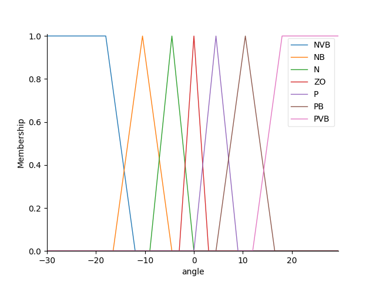
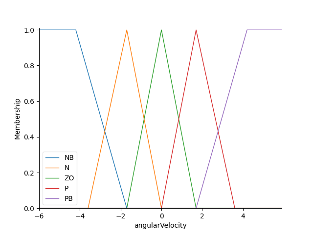

#Info

**Nome:** João Vitor Dias dos Santos </br>
**RA:** 22.119.006-9
***
# Aplicação de lógica fuzzy em Ar-Condicionados

A lógica fuzzy é aplicada em ar-condicionados afim de controlar a umidade e temperatura do ambiente. Além disso, ela também é usada para economizar a energia do aparelho, na tentativa de aumentar a vida útil do mesmo. Um exemplo da lógica fuzzy sendo aplicada nesse tipo de dispositivo é o paper [Developing of Fuzzy Logic Controller for Air Condition System](https://www.ijcaonline.org/research/volume126/number15/sobhy-2015-ijca-906083.pdf).
***
# Resultados
## 1. Swing-Up
### 1.1. Entradas


**Ângulo:** 60º </br>
**Velocidade Angular:** 10 rad/s </br>
***
### 1.2. Saídas
#### 1.2.1. Funções de Pertinência
##### 1.2.1.1. Ângulo


```python
self.angle = Antecedent(np.arange(0, 300, 1), 'angle')

self.angle['NLS'] = fuzz.trimf(self.angle.universe, [90, 130, 170])
self.angle['NBS'] = fuzz.trimf(self.angle.universe, [30, 150, 170])
self.angle['SALN'] = fuzz.trimf(self.angle.universe, [170, 175, 180])
self.angle['Z'] = fuzz.trimf(self.angle.universe, [180, 180, 180])
self.angle['SALP'] = fuzz.trimf(self.angle.universe, [180, 185, 190])
self.angle['PBS'] = fuzz.trimf(self.angle.universe, [190, 210, 330])
self.angle['PLS'] = fuzz.trimf(self.angle.universe, [190, 230, 270])
```
***
##### 1.2.1.2. Velocidade Angular


```python
self.angular_velocity = Antecedent(np.arange(-10, 10, 0.1), 'angularVelocity')

self.angular_velocity['NEG'] = fuzz.trapmf(self.angular_velocity.universe, [-10, -10, -1, 0])
self.angular_velocity['ZS'] = fuzz.trapmf(self.angular_velocity.universe, [-0.1, 0, 0, 0.1])
self.angular_velocity['POS'] = fuzz.trapmf(self.angular_velocity.universe, [0, 1, 10, 10])
```
***
##### 1.2.1.3. Força Aplicada


```python
self.applied_force = Consequent(np.arange(-6, 6, 0.2), 'appliedForce')

self.applied_force['NVVB'] = fuzz.trapmf(self.applied_force.universe, [-6, -6, -4.8, -3.6])
self.applied_force['NVB'] = fuzz.trimf(self.applied_force.universe, [-4.8, -3.6, -2.4])
self.applied_force['NB'] = fuzz.trimf(self.applied_force.universe, [-3.6, -2.4, -1.2])
self.applied_force['N'] = fuzz.trimf(self.applied_force.universe, [-2.4, -1.2, 0])
self.applied_force['Z'] = fuzz.trimf(self.applied_force.universe, [-1.2, 0, 1.2])
self.applied_force['P'] = fuzz.trimf(self.applied_force.universe, [0, 1.2, 2.4])
self.applied_force['PB'] = fuzz.trimf(self.applied_force.universe, [1.2, 2.4, 3.6])
self.applied_force['PVB'] = fuzz.trimf(self.applied_force.universe, [2.4, 3.6, 4.8])
self.applied_force['PVVB'] = fuzz.trapmf(self.applied_force.universe, [3.6, 4.8, 6, 6])
```
***
#### 1.2.2. Regras e Superfícies de Decisão

```python
self.rules = [
    Rule(self.angle['NLS'] & self.angular_velocity['POS'], self.applied_force['NB']),
    Rule(self.angle['NBS'] & self.angular_velocity['POS'], self.applied_force['Z']),
    Rule(self.angle['SALN'] & self.angular_velocity['POS'], self.applied_force['N']),
    Rule(self.angle['Z'] & self.angular_velocity['ZS'], self.applied_force['P']),
    Rule(self.angle['SALP'] & self.angular_velocity['NEG'], self.applied_force['P']),
    Rule(self.angle['PBS'] & self.angular_velocity['NEG'], self.applied_force['Z']),
    Rule(self.angle['PLS'] & self.angular_velocity['NEG'], self.applied_force['PB'])
]
```


***

## 2. Estabilização
### 2.1. Entradas


**Ângulo:** 60º </br>
**Velocidade Angular:** 10 rad/s </br>
**Posição do Carrinho:** 30m </br>
**Velocidade do Carrinho:** 18m/s </br>
***
### 2.2. Saídas
#### 2.2.1. Funções de Pertinência
##### 2.2.1.1. Ângulo


```python
self.angle = Antecedent(np.arange(-30, 30, 0.5), 'angle')

self.angle['NVB'] = fuzz.trapmf(self.angle.universe, [-30, -30, -18, -12])
self.angle['NB'] = fuzz.trimf(self.angle.universe, [-16.5, -10.5, -4.5])
self.angle['N'] = fuzz.trimf(self.angle.universe, [-9, -4.5, 0])
self.angle['ZO'] = fuzz.trimf(self.angle.universe, [-3, 0, 3])
self.angle['P'] = fuzz.trimf(self.angle.universe, [0, 4.5, 9])
self.angle['PB'] = fuzz.trimf(self.angle.universe, [4.5, 10.5, 16.5])
self.angle['PVB'] = fuzz.trapmf(self.angle.universe, [12, 18, 30, 30])
```
***
##### 2.2.1.2 Velocidade Angular


```python
self.angular_velocity = Antecedent(np.arange(-6, 6, 0.1), 'angularVelocity')

self.angular_velocity['NB'] = fuzz.trapmf(self.angular_velocity.universe, [-6, -6, -4.2, -1.7])
self.angular_velocity['N'] = fuzz.trimf(self.angular_velocity.universe, [-3.6, -1.7, 0])
self.angular_velocity['ZO'] = fuzz.trimf(self.angular_velocity.universe, [-1.7, 0, 1.7])
self.angular_velocity['P'] = fuzz.trimf(self.angular_velocity.universe, [0, 1.7, 3.6])
self.angular_velocity['PB'] = fuzz.trapmf(self.angular_velocity.universe, [1.7, 4.2, 6, 6])
```
***
##### 2.2.1.3 Posição do Carrinho


```python
self.cart_position = Antecedent(np.arange(-0.4, 0.4, 0.05), 'cartPosition')

self.cart_position['NBIG'] = fuzz.trapmf(self.cart_position.universe, [-0.4, -0.4, -0.3, -0.15])
self.cart_position['NEG'] = fuzz.trimf(self.cart_position.universe, [-0.3, -0.15, 0])
self.cart_position['Z'] = fuzz.trimf(self.cart_position.universe, [-0.15, 0, 0.15])
self.cart_position['POS'] = fuzz.trimf(self.cart_position.universe, [0, 0.15, 0.3])
self.cart_position['PBIG'] = fuzz.trapmf(self.cart_position.universe, [0.15, 0.3, 0.4, 0.4])
```
***
##### 2.2.1.4 Velocidade do Carrinho


```python
self.cart_velocity = Antecedent(np.arange(-1, 1, 0.1), 'cartVelocity')

self.cart_velocity['NEG'] = fuzz.trapmf(self.cart_velocity.universe, [-1, -1, -0.1, 0])
self.cart_velocity['ZERO'] = fuzz.trimf(self.cart_velocity.universe, [-0.1, 0, 0.1])
self.cart_velocity['POS'] = fuzz.trapmf(self.cart_velocity.universe, [0, 0.1, 1, 1])
```
***
##### 2.2.1.5 Força Aplicada


```python
self.applied_force = Consequent(np.arange(-6, 6, 0.2), 'appliedForce')

self.applied_force['NVVB'] = fuzz.trapmf(self.applied_force.universe, [-6, -6, -4.8, -3.6])
self.applied_force['NVB'] = fuzz.trimf(self.applied_force.universe, [-4.8, -3.6, -2.4])
self.applied_force['NB'] = fuzz.trimf(self.applied_force.universe, [-3.6, -2.4, -1.2])
self.applied_force['N'] = fuzz.trimf(self.applied_force.universe, [-2.4, -1.2, 0])
self.applied_force['Z'] = fuzz.trimf(self.applied_force.universe, [-1.2, 0, 1.2])
self.applied_force['P'] = fuzz.trimf(self.applied_force.universe, [0, 1.2, 2.4])
self.applied_force['PB'] = fuzz.trimf(self.applied_force.universe, [1.2, 2.4, 3.6])
self.applied_force['PVB'] = fuzz.trimf(self.applied_force.universe, [2.4, 3.6, 4.8])
self.applied_force['PVVB'] = fuzz.trapmf(self.applied_force.universe, [3.6, 4.8, 6, 6])
```
***
#### 2.2.2. Regras e Superfícies de Decisão

```python
 self.rules = [
    Rule(self.cart_position['NBIG'] & self.cart_velocity['NEG'], self.applied_force['PVVB']),
    Rule(self.cart_position['NEG'] & self.cart_velocity['NEG'], self.applied_force['PVB']),
    Rule(self.cart_position['Z'] & self.cart_velocity['NEG'], self.applied_force['PB']),
    Rule(self.cart_position['Z'] & self.cart_velocity['ZERO'], self.applied_force['Z']),
    Rule(self.cart_position['Z'] & self.cart_velocity['POS'], self.applied_force['NB']),
    Rule(self.cart_position['POS'] & self.cart_velocity['POS'], self.applied_force['NVB']),
    Rule(self.cart_position['PBIG'] & self.cart_velocity['POS'], self.applied_force['NVVB']),

    Rule(self.angle['NVB'] & self.angular_velocity['NB'], self.applied_force['NVVB']),
    Rule(self.angle['NVB'] & self.angular_velocity['N'], self.applied_force['NVVB']),
    Rule(self.angle['NVB'] & self.angular_velocity['ZO'], self.applied_force['NVB']),
    Rule(self.angle['NVB'] & self.angular_velocity['P'], self.applied_force['NB']),
    Rule(self.angle['NVB'] & self.angular_velocity['PB'], self.applied_force['N']),

    Rule(self.angle['NB'] & self.angular_velocity['NB'], self.applied_force['NVVB']),
    Rule(self.angle['NB'] & self.angular_velocity['N'], self.applied_force['NVB']),
    Rule(self.angle['NB'] & self.angular_velocity['ZO'], self.applied_force['NB']),
    Rule(self.angle['NB'] & self.angular_velocity['P'], self.applied_force['N']),
    Rule(self.angle['NB'] & self.angular_velocity['PB'], self.applied_force['Z']),

    Rule(self.angle['N'] & self.angular_velocity['NB'], self.applied_force['NVB']),
    Rule(self.angle['N'] & self.angular_velocity['N'], self.applied_force['NB']),
    Rule(self.angle['N'] & self.angular_velocity['ZO'], self.applied_force['N']),
    Rule(self.angle['N'] & self.angular_velocity['P'], self.applied_force['Z']),
    Rule(self.angle['N'] & self.angular_velocity['PB'], self.applied_force['P']),

    Rule(self.angle['ZO'] & self.angular_velocity['NB'], self.applied_force['NB']),
    Rule(self.angle['ZO'] & self.angular_velocity['N'], self.applied_force['N']),
    Rule(self.angle['ZO'] & self.angular_velocity['ZO'], self.applied_force['Z']),
    Rule(self.angle['ZO'] & self.angular_velocity['P'], self.applied_force['P']),
    Rule(self.angle['ZO'] & self.angular_velocity['PB'], self.applied_force['PB']),

    Rule(self.angle['P'] & self.angular_velocity['NB'], self.applied_force['N']),
    Rule(self.angle['P'] & self.angular_velocity['N'], self.applied_force['Z']),
    Rule(self.angle['P'] & self.angular_velocity['ZO'], self.applied_force['P']),
    Rule(self.angle['P'] & self.angular_velocity['P'], self.applied_force['PB']),
    Rule(self.angle['P'] & self.angular_velocity['PB'], self.applied_force['PVB']),

    Rule(self.angle['PB'] & self.angular_velocity['NB'], self.applied_force['Z']),
    Rule(self.angle['PB'] & self.angular_velocity['N'], self.applied_force['P']),
    Rule(self.angle['PB'] & self.angular_velocity['ZO'], self.applied_force['PB']),
    Rule(self.angle['PB'] & self.angular_velocity['P'], self.applied_force['PVB']),
    Rule(self.angle['PB'] & self.angular_velocity['PB'], self.applied_force['PVVB']),

    Rule(self.angle['PVB'] & self.angular_velocity['NB'], self.applied_force['P']),
    Rule(self.angle['PVB'] & self.angular_velocity['N'], self.applied_force['PB']),
    Rule(self.angle['PVB'] & self.angular_velocity['ZO'], self.applied_force['PVB']),
    Rule(self.angle['PVB'] & self.angular_velocity['P'], self.applied_force['PVVB']),
    Rule(self.angle['PVB'] & self.angular_velocity['PB'], self.applied_force['PVVB'])
]
```


***
